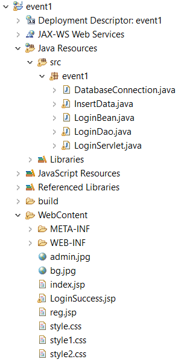
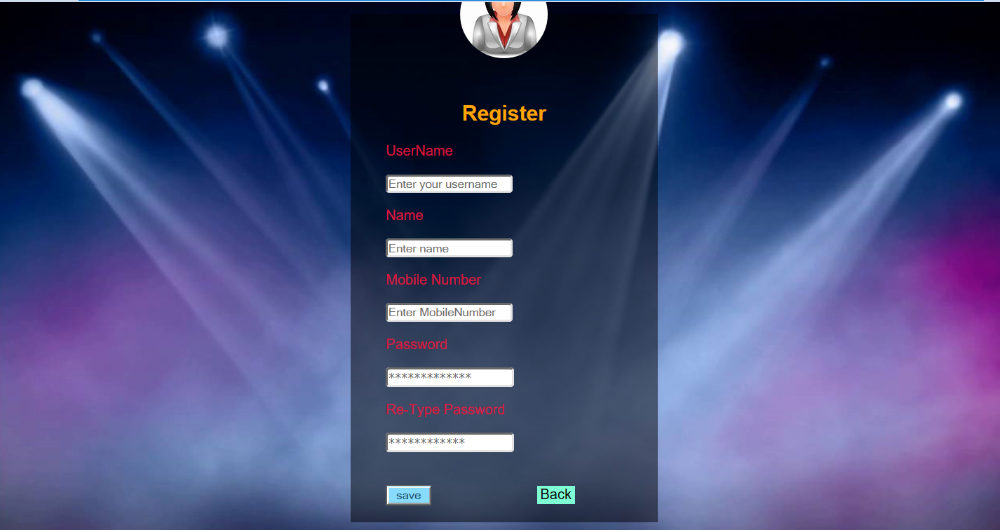
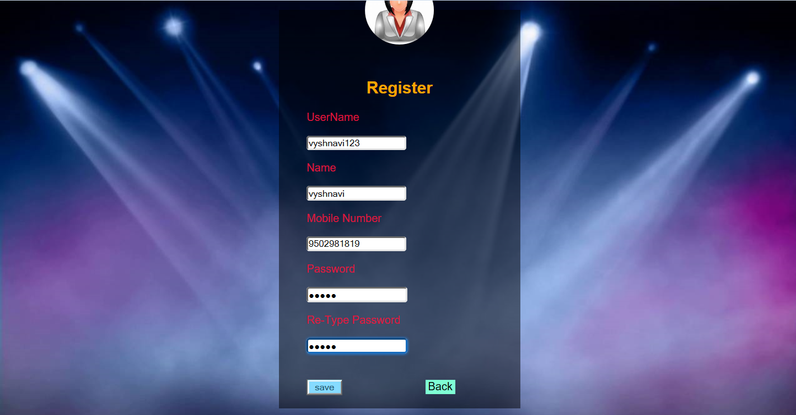
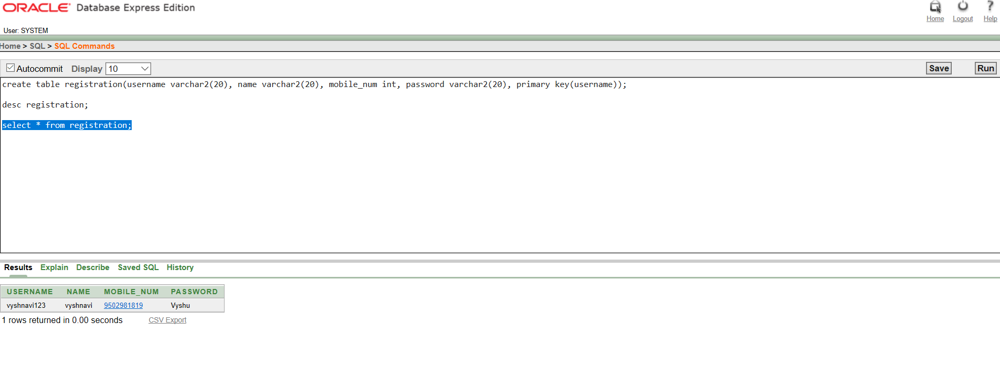
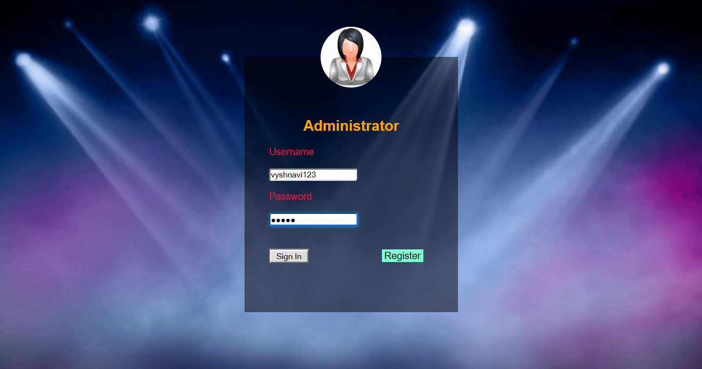

# collage_event

This is a simple project I've made with html, css, javascript and jdbc.

# Aim:

 This is an efficient Automating Student Performance Analysis system software project that
serves the functionality of an event manager. The event manager is the person who plans and
executes the event, taking responsibility for the creative, technical and logistical elements.
This includes overall event design, C, Java and Extra Curricular Activities,. The system
allows only registered users to login and new users are allowed to register on the application.
 The project provides most of the basic functionality required for an event. It allows the user
to select from a list of event types. Once the user enters an event type the system then allows
the user to select the date and time of event.

# Softwares Required

1. Eclipse IDE,
2. Oracle DataBase Express Edition,
3. OJDBC6.jar.

# Code
    I've given this on resporatory.

# Screenshots

This is how the main page looks like:

Registration page:

The values which we entered in registration page will get stored in database:

The DataBase after Inserting values:

We can login with registered details:

After logged in succesfully I've given dynamic dependent drop down list using html javascript for 3 drop down. Please check the video for this.
This is how it looks like:

Thank You.
